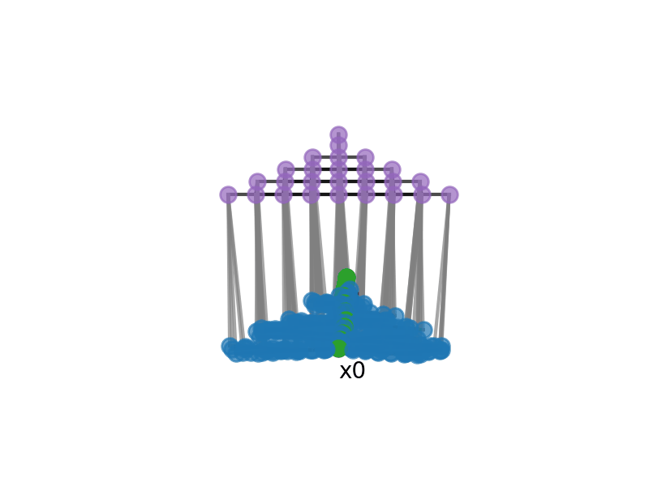
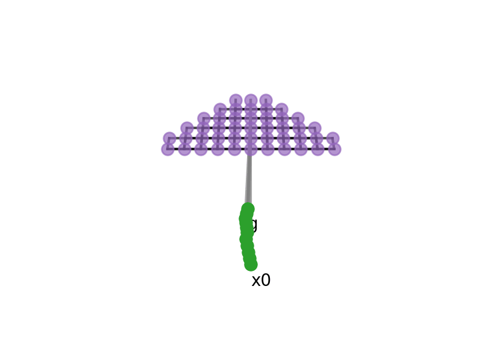
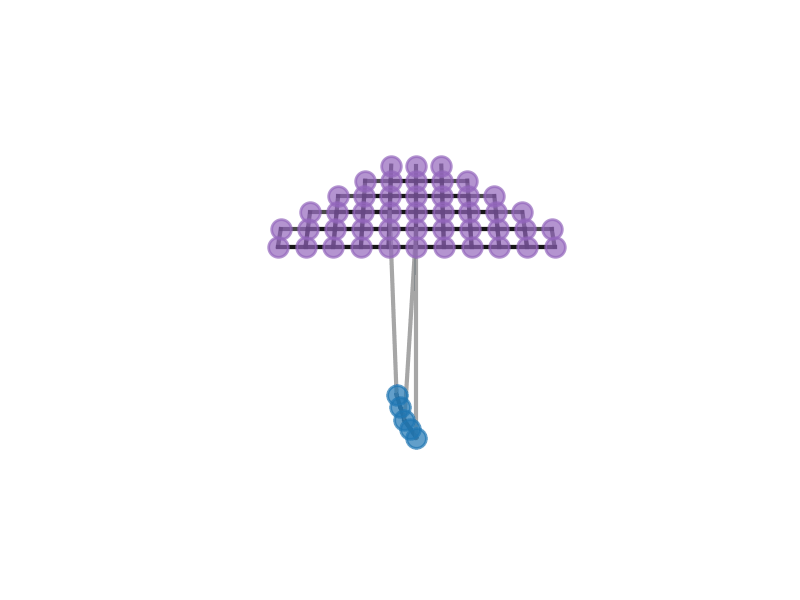
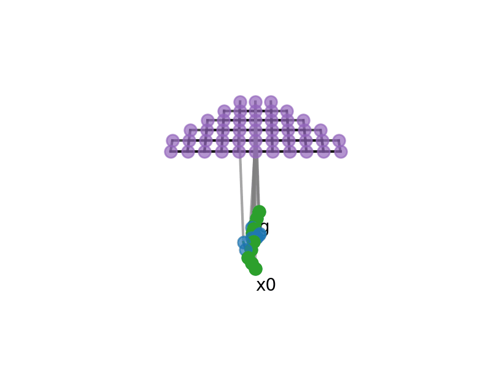
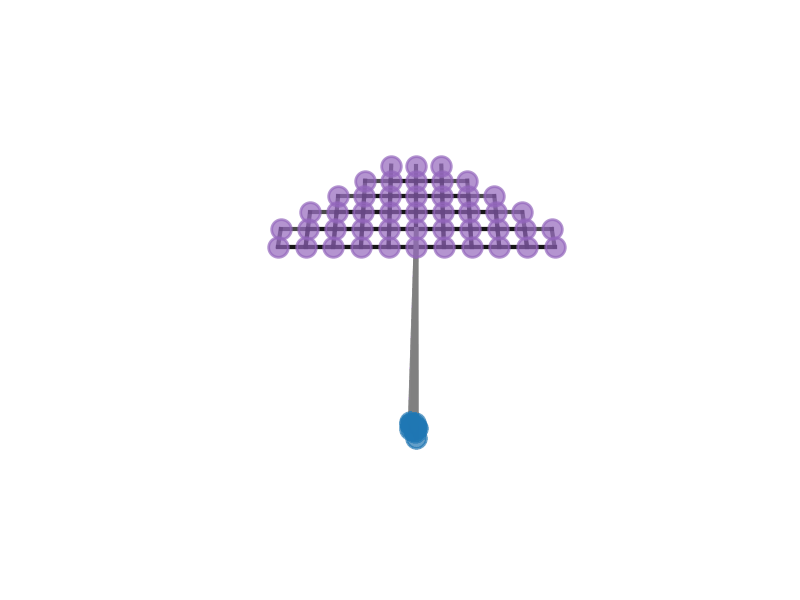
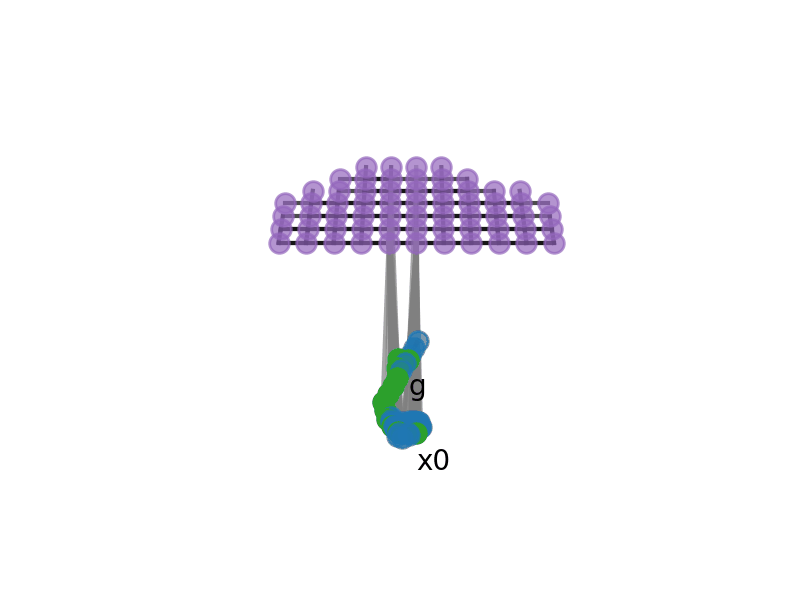
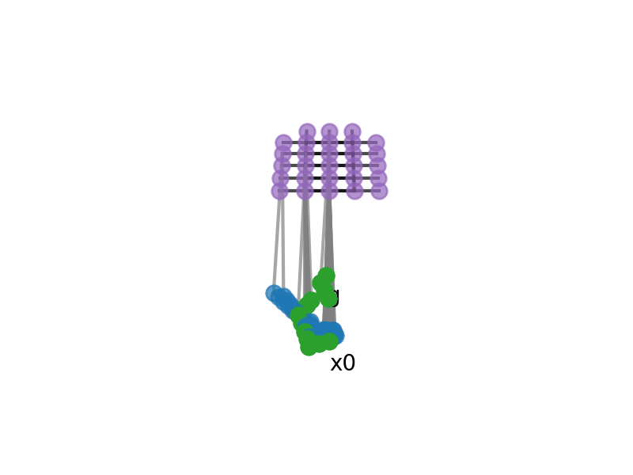

# Bilevel Planning

Methods for robot planning with abstractions.

## Requirements

- Python 3.10+
- Tested on MacOS Catalina

## Installation

We strongly recommend [uv](https://docs.astral.sh/uv/getting-started/installation/). The steps below assume that you have `uv` installed. If you do not, just remove `uv` from the commands and the installation should still work.

```
# Install PRPL dependencies.
uv pip install -r prpl_requirements.txt
# Install this package and third-party dependencies.
uv pip install -e ".[develop]"
```

## Primer on Bilevel Planning

This section gives a brief overview of bilevel planning as implemented in this codebase.

### Problem Setting

We consider fully-observed, deterministic, goal-based planning problems. (There are ways
to weaken each of these assumptions, but we will keep things simple to start.) Each
problem is characterized by:

1. A _state space_ $`\mathcal{X}`$ where $`x \in \mathcal{X}`$ is a _state_
2. An _action space_ $`\mathcal{U}`$ where $`u \in \mathcal{U}`$ is an _action_
3. A _transition function_ $`f: \mathcal{X} \times \mathcal{U} \to \mathcal{X}`$
4. An _initial state_ $`x_0 \in \mathcal{X}`$
5. A _goal_ $g \subseteq \mathcal{X}$

In general, our objective is to find a _plan_ $`u_1, \dots, u_T`$ that achieves the goal,
that is, $`x_T \in g`$ and $`x_t = f(x_{t-1}, u_t)`$ for $`1 \le t \le T`$. Depending on
the setting, we may also care about the plan length $`T`$, and the _planning time_, that
is, the actual time taken to find the plan itself, among other possible metrics.

We typically consider not just one planning problem, but a distribution of planning
problems that have shared state spaces, action spaces, and transition functions, but
different initial states and goals. Sometimes we assume that a training set of planning
problems are available (perhaps with example plans) and reserve a test set.

> **Example:**  
> A robot is tasked with moving objects from a table onto a shelf. The initial state includes the poses of all objects and the configuration of the robot. Actions are changes to the robot configuration. The transition function models physics.

### Abstractions

Bilevel planning uses abstractions to make planning more efficient and effective.
In particular:

1. An _abstract state space_ $`\mathcal{S}`$ where $`s \in \mathcal{S}`$ is an _abstract state_
2. An _abstract action space_ $`\mathcal{A}`$ where $`a \in \mathcal{A}`$ is an _abstract action_
3. An _abstract transition function_ $`F: \mathcal{S} \times \mathcal{A} \to \mathcal{S}`$
4. A _state abstractor_ $`\Psi: \mathcal{X} \to \mathcal{S}`$

> **Example:**  
> The initial abstract state is "cup on table, bowl on table, robot hand empty, ...". Note that this (discrete) abstract state loses information about the exact (continuous) object poses and robot configuration. Abstract actions are "grasp cup", "place bowl in shelf", etc. The abstract transition function says, for example, that "grasp cup" in "cup on table, bowl on table, robot hand empty, ..." will lead to "cup grasped, bowl on table, ...".

In practice, rather than using an abstract transition function, we use an _abstract successor function_ that outputs a sequence of (abstract action, next abstract state). This is convenient when there are a large number of possible abstract actions, but a small number that are valid for any given abstract state.

### Bilevel Planning Graph

There are different ways that abstractions can help with planning. We discuss a few below. The common thread is that all planners construct a _bilevel planning graph_ as they search for a plan. A bilevel planning graph includes:

1. _State nodes_: associated with states $`x \in \mathcal{X}`$
2. _Abstract state nodes_: associated with abstract states $`s \in \mathcal{S}`$
3. _Action edges_: between state nodes, associated with actions $`u \in \mathcal{U}`$
4. _Abstract action edges_: between abstract state nodes, associated with abstract actions $`a \in \mathcal{A}`$
5. _State abstractor edges_: from a state node with $`x`$ to an abstract state node with $`s`$ where $`\Psi(x) = s`$

Note that this graph is certainly "partial" in the sense that not it does not include all states, abstract states, actions, and abstract actions. The job of a bilevel planner is to determine which nodes and edges to create while searching for a plan.

### Bilevel Planner Examples

We now discuss a few examples of bilevel planners.

#### Abstract Breadth-First Search


> See `test_abstract_bfs_planner.py` for GIF generation.

This bilevel planner starts by abstracting the initial state. It then performs breadth-first search in the abstract state and action space. Expanding an abstract state node with $`s`$ works as follows:
```
for a in A:  # optimization: valid actions only
  ns = F(s, a)  # defines a "subgoal"
  repeat N times:
    x = sample_state(s)  # among x already in graph
    try:
      x_traj, u_traj = sample_trajectory(x, s, a, ns)
    except TrajectorySamplingFailure:
      continue
```
The `sample_trajectory` function attempts to find a trajectory of states and actions where:
- The initial state `x_traj[0] = x` is already in the graph and abstracts to `s`
- The final state `x_traj[-1]` abstracts to `ns`
- The trajectory follows the transition function $f$

There are different ways to implement `sample_trajectory`. One technique is to use trajectory optimization. This typically requires the transition function $`f`$ to be smooth, and sometimes requires it to be implemented in a certain way (e.g., with Jax or PyTorch or Drake wrappers). Another technique is to assume that each abstract action $`a`$ is associated with a parameterized policy $`u = \pi_a(x \mid \theta)`$ and a sampler that proposes parameters $`\theta`$ conditioned on the state where the policy is first invoked. We typically use this second technique.

This bilevel planner can work better than a "flat" planner when the subgoals produced by the abstractions represent a "good" problem decomposition. However, this bilevel planner can also be very slow, especially when $|\mathcal{S}|$, $|\mathcal{A}|$, and/or $N$ are large.

#### Single Abstract Plan + Greedy Refinement

| Success Example             |  Failure Example |
:-------------------------:|:-------------------------:
 |  
> See `test_sesame_planner.py` for GIF generation.

This bilevel planner improves planning time by finding and committing to a single abstract plan before any (low level) states and actions are considered. To do this, we need to be able to check goals at the abstract level. Typically we assume that goals are represented as sets of abstract states. Once an abstract plan is found, we attempt to "refine" each abstract transition in sequence (greedily). See the pseudocode below.

```
s0 = get_abstract_state(x0)  # ψ
s_plan, a_plan = run_abstract_search(s0, A, F, g)
x_plan, u_plan = [x0], []
for s, a, ns in zip(s_plan[:-1], a_plan, s_plan[1:]):
  x_traj, u_traj = sample_trajectory(x_plan[-1], s, a, ns)  # may fail
  x_plan.extend(x_traj)
  u_plan.extend(u_traj)
```

This can be much faster, but at the expense of completeness: it is possible that no plan is found, even if one exists. One failure mode is that the trajectory sampled for one abstract transition can make a future abstract transition "unrefinable." For instance, imagine grasping a cup from the top, but then later trying to place it into a very short shelf; collisions between the wrist and shelf ceiling may prevent placement.

#### Single Abstract Plan + Backtracking Refinement

| Success Example             |  Failure Example |
:-------------------------:|:-------------------------:
 |  
> See `test_sesame_planner.py` for GIF generation. In the failure example, there is a simulated obstacle that fully blocks the first abstract plan.

To get unstuck in cases like the one mentioned above, we can backtrack. A simple way to implement backtracking is to attempt $`K`$ refinements for each abstract transition before moving back to the previous one.

```
s0 = get_abstract_state(x0)  # ψ
s_plan, a_plan = run_abstract_search(s0, A, F, g)

def refine_from_step(index, x):
  if index == len(a_plan):
    return True, []  # successfully refined all transitions

  s = s_plan[index]
  a = a_plan[index]
  ns = s_plan[index + 1]

  for k in range(K):
    try:
      x_traj, u_traj = sample_trajectory(x, s, a, ns)
      success, remainder = refine_from_step(index + 1, x_traj[-1])
      if success:
        return True, [(x_traj, u_traj)] + remainder
      except TrajectorySamplingFailure:
        continue

  return False, None  # backtrack

success, full_plan = refine_from_step(0, x0)
```

This is better, but even putting aside the issue of choosing $`K`$, this planner is still incomplete: some abstract transitions may always be unrefinable given the initial state of the problem $`x_0`$. We can address this issue by considering _multiple_ abstract plans, rather than committing to a single one.

#### Multi-Abstract Plan + Backtracking Refinement ("SeSamE")


> See `test_sesame_planner.py` for GIF generation.

This bilevel planner is the same as the one above, except that multiple abstract plans are generated in an outer loop until one is successfully refined. It is also possible to generate and refine abstract plans in parallel rather than in sequence.

```
for (s_plan, a_plan) in iter_abstract_plans(s0, A, F, g):
  try:
    x_plan, u_plan = refine(s_plan, a_plan)  # backtracking
  except RefinementFailure:
    continue
```

We typically iterate over abstract plans in order from shortest to longest (in terms of abstract plan length), breaking ties randomly.

For "historical" reasons, we refer to this combination of multi-abstract plan generation and backtracking refinement as "SeSamE", which stands for Search, Sample, and Execute. This planner is still technically incomplete, because each abstract transition is only refined a finite number of times. Moreover, when there are frequent refinement failures or poorly behaved abstractions, this planner can be very slow. However, it does have the nice property that when refinement failures are rare, planning is fast. And unlike the previous planners, when there are refinement failures, this planner can recover eventually (for sufficiently large $`K`$). This is the planner that we have most often used in our work on _learning for bilevel planning_.

#### Relational Abstractions and PDDL


> See `test_sesame_planner.py` for GIF generation.

We have so far been very "abstract" in our discussion of abstractions. In practice, we often use _relational_ abstractions that allow us to take advantage of powerful techniques from classical AI planning. In particular, if we assume that abstract states and goals are represented with _atoms_ and abstract actions are represented with _operators_, then we can use PDDL planners to implement abstract search. This can lead to dramatic improvements in abstract plan generation.
