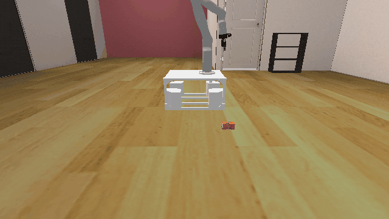
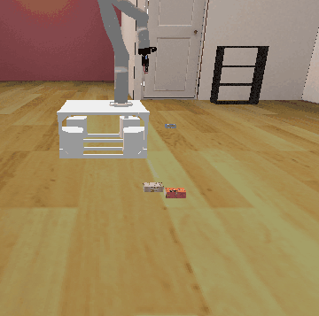

# Shelf3D

**Random Action Stats**: Total Reward: -25.00, Success: No, Steps: 25

## Description
A 3D environment where the goal is to pick up objects from the ground and place them onto a shelf.

## Available Variants
The number of objects differs between environment variants. For example, Shelf3D-o1 has 1 object, while Shelf3D-o10 has 10 objects.

- [`kinder/Shelf3D-o1-v0`](variants/Shelf3D/Shelf3D-o1.md) (o1)
- [`kinder/Shelf3D-o2-v0`](variants/Shelf3D/Shelf3D-o2.md) (o2)
- [`kinder/Shelf3D-o3-v0`](variants/Shelf3D/Shelf3D-o3.md) (o3)
- [`kinder/Shelf3D-o5-v0`](variants/Shelf3D/Shelf3D-o5.md) (o5)
- [`kinder/Shelf3D-o10-v0`](variants/Shelf3D/Shelf3D-o10.md) (o10)

## Initial State Distribution

## Example Demonstration

## Observation Space
*(Differs per variant, see individual variant pages)*

## Action Space
An action space for mobile manipulation with a 7 DOF robot that can open and close its gripper.

Actions are bounded relative base position, rotation, and joint positions, and open / close.

| **Index** | **Description** |
| --- | --- |
| 0 | delta base x |
| 1 | delta base y |
| 2 | delta base rotation |
| 3 | delta joint 1 |
| 4 | delta joint 2 |
| 5 | delta joint 3 |
| 6 | delta joint 4 |
| 7 | delta joint 5 |
| 8 | delta joint 6 |
| 9 | delta joint 7 |
| 10 | gripper open/close |

The open / close logic is: <-0.5 is close, >0.5 is open, and otherwise no change.

## Rewards
The reward is -1 per timestep to encourage efficient task completion. The episode terminates successfully when all objects are placed on the shelf (i.e., above the first shelf layer) and the gripper is closed. The gripper must be closed to prevent accidental "success" while an object is still being held above the shelf.

## References
This is a very common kind of environment. The background is adapted from the [Replica dataset](https://arxiv.org/abs/1906.05797) (Straub et al., 2019).
