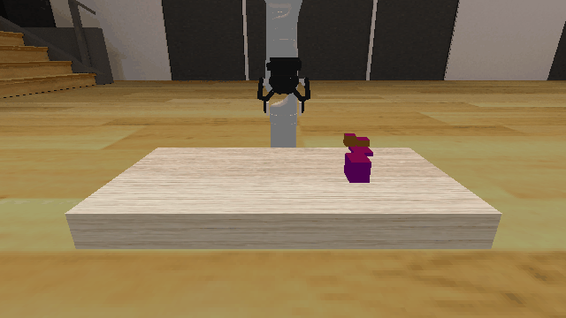
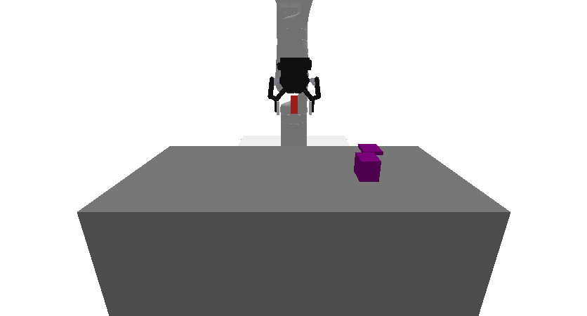

# Obstruction3D

## Description
A 3D obstruction clearance environment where the goal is to place a target block on a designated target region by first clearing obstructions.

The robot is a Kinova Gen-3 with 7 degrees of freedom that can grasp and manipulate objects. The environment consists of:
- A **table** with dimensions 0.400m × 0.800m × 0.500m
- A **target region** (purple block) with random dimensions between (0.02, 0.02, 0.005) and (0.05, 0.05, 0.005) half-extents
- A **target block** that must be placed on the target region, sized at 0.8× the target region's x,y dimensions
- **Obstruction(s)** (red blocks) that may be placed on or near the target region, blocking access

Obstructions have random dimensions between (0.01, 0.01, 0.01) and (0.02, 0.02, 0.03) half-extents. During initialization, there's a 0.9 probability that each obstruction will be placed on the target region, requiring clearance.

The task requires planning to grasp and move obstructions out of the way, then place the target block on the target region.

## Available Variants
- `prbench/Obstruction3D-o0-v0` (o0)
- `prbench/Obstruction3D-o1-v0` (o1)
- `prbench/Obstruction3D-o2-v0` (o2)
- `prbench/Obstruction3D-o3-v0` (o3)
- `prbench/Obstruction3D-o4-v0` (o4)

## Initial State Distribution

## Example Demonstration
*(No demonstration GIFs available)*

## Observation Space
The entries of an array in this Box space correspond to the following object features:
| **Index** | **Object** | **Feature** |
| --- | --- | --- |
| 0 | robot | pos_base_x |
| 1 | robot | pos_base_y |
| 2 | robot | pos_base_rot |
| 3 | robot | joint_1 |
| 4 | robot | joint_2 |
| 5 | robot | joint_3 |
| 6 | robot | joint_4 |
| 7 | robot | joint_5 |
| 8 | robot | joint_6 |
| 9 | robot | joint_7 |
| 10 | robot | finger_state |
| 11 | robot | grasp_active |
| 12 | robot | grasp_tf_x |
| 13 | robot | grasp_tf_y |
| 14 | robot | grasp_tf_z |
| 15 | robot | grasp_tf_qx |
| 16 | robot | grasp_tf_qy |
| 17 | robot | grasp_tf_qz |
| 18 | robot | grasp_tf_qw |
| 19 | target_region | pose_x |
| 20 | target_region | pose_y |
| 21 | target_region | pose_z |
| 22 | target_region | pose_qx |
| 23 | target_region | pose_qy |
| 24 | target_region | pose_qz |
| 25 | target_region | pose_qw |
| 26 | target_region | grasp_active |
| 27 | target_region | object_type |
| 28 | target_region | half_extent_x |
| 29 | target_region | half_extent_y |
| 30 | target_region | half_extent_z |
| 31 | target_block | pose_x |
| 32 | target_block | pose_y |
| 33 | target_block | pose_z |
| 34 | target_block | pose_qx |
| 35 | target_block | pose_qy |
| 36 | target_block | pose_qz |
| 37 | target_block | pose_qw |
| 38 | target_block | grasp_active |
| 39 | target_block | object_type |
| 40 | target_block | half_extent_x |
| 41 | target_block | half_extent_y |
| 42 | target_block | half_extent_z |
| 43 | obstruction0 | pose_x |
| 44 | obstruction0 | pose_y |
| 45 | obstruction0 | pose_z |
| 46 | obstruction0 | pose_qx |
| 47 | obstruction0 | pose_qy |
| 48 | obstruction0 | pose_qz |
| 49 | obstruction0 | pose_qw |
| 50 | obstruction0 | grasp_active |
| 51 | obstruction0 | object_type |
| 52 | obstruction0 | half_extent_x |
| 53 | obstruction0 | half_extent_y |
| 54 | obstruction0 | half_extent_z |
| 55 | obstruction1 | pose_x |
| 56 | obstruction1 | pose_y |
| 57 | obstruction1 | pose_z |
| 58 | obstruction1 | pose_qx |
| 59 | obstruction1 | pose_qy |
| 60 | obstruction1 | pose_qz |
| 61 | obstruction1 | pose_qw |
| 62 | obstruction1 | grasp_active |
| 63 | obstruction1 | object_type |
| 64 | obstruction1 | half_extent_x |
| 65 | obstruction1 | half_extent_y |
| 66 | obstruction1 | half_extent_z |

## Action Space
An action space for a 7 DOF robot that can open and close its gripper.

    Actions are bounded relative joint positions and open / close.

    The open / close logic is: <-0.5 is close, >0.5 is open, and otherwise no change.

## Rewards
The reward structure is simple:
- **-1.0** penalty at every timestep until the goal is reached
- **Termination** occurs when the target block is placed on the target region (while not being grasped)

The goal is considered reached when:
1. The robot is not currently grasping the target block
2. The target block is resting on (supported by) the target region

Support is determined based on contact between the target block and target region, within a small distance threshold (1e-4).

This encourages the robot to efficiently clear obstructions and place the target block while avoiding infinite episodes.

## References
Similar environments have been used many times, especially in the task and motion planning literature. We took inspiration especially from the "1D Continuous TAMP" environment in [PDDLStream](https://github.com/caelan/pddlstream).
