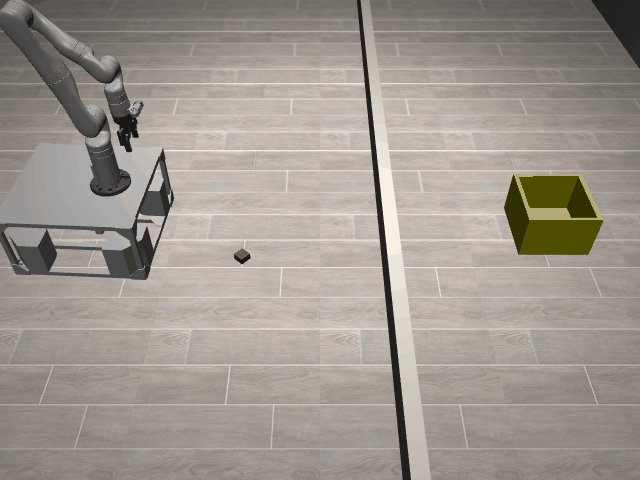
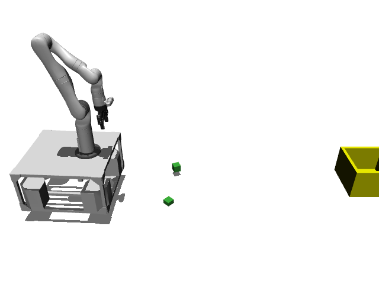

# Tossing3D

**Random Action Stats**: Total Reward: -0.25, Success: No, Steps: 25

## Description
A 3D mobile manipulation environment using the TidyBot platform.

The robot has a holonomic mobile base with powered casters and a Kinova Gen3 arm.
Scene type: lab2 with 1 objects.

The robot can control:
- Base pose (x, y, theta)
- Arm position (x, y, z)
- Arm orientation (quaternion)
- Gripper position (open/close)

## Available Variants
This environment has variants that differ in scene type and number of objects. Scene types include 'ground', 'cabinet', etc. The number of objects varies across variants.

- [`prbench/TidyBot3D-Tossing3D-lab2-o2-toss_the_blocks_into_the_bin-v0`](variants/Tossing3D/TidyBot3D-Tossing3D-lab2-o2-toss_the_blocks_into_the_bin.md) (TidyBot3D-lab2-o2-toss_the_blocks_into_the_bin)
- [`prbench/TidyBot3D-Tossing3D-lab2-o1-toss_the_blocks_into_the_bin-v0`](variants/Tossing3D/TidyBot3D-Tossing3D-lab2-o1-toss_the_blocks_into_the_bin.md) (TidyBot3D-lab2-o1-toss_the_blocks_into_the_bin)

## Initial State Distribution

## Example Demonstration
*(No demonstration GIFs available)*

## Observation Space
*(Differs per variant, see individual variant pages)*

## Action Space
Actions: base pos and yaw (3), arm joints (7), gripper pos (1)

## Rewards
Reward function depends on the specific task:
- Object stacking: Reward for successfully stacking objects
- Drawer/cabinet tasks: Reward for opening/closing and placing objects
- General manipulation: Reward for successful pick-and-place operations

Currently returns a small negative reward (-0.01) per timestep to encourage exploration.

## References
TidyBot++: An Open-Source Holonomic Mobile Manipulator
for Robot Learning
- Jimmy Wu, William Chong, Robert Holmberg, Aaditya Prasad, Yihuai Gao,
  Oussama Khatib, Shuran Song, Szymon Rusinkiewicz, Jeannette Bohg
- Conference on Robot Learning (CoRL), 2024

https://github.com/tidybot2/tidybot2
