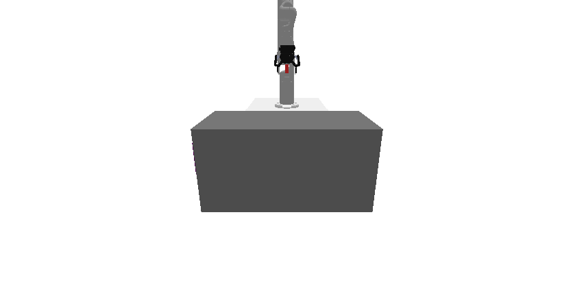
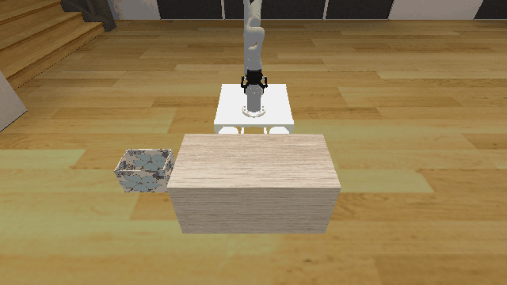
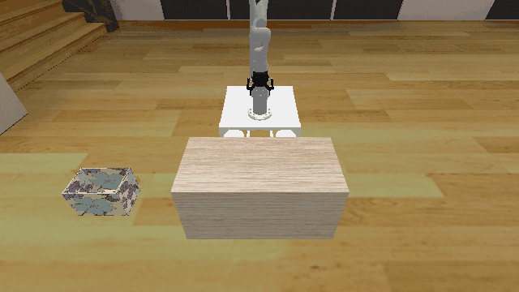

# Transport3D

**Random Action Stats**: Total Reward: -25.00, Success: No, Steps: 25

## Description
A 3D environment where the goal is to place all objects, including one or more solid cubes and a box, on a table.

## Available Variants
The number of cubes differs between environment variants. For example, Transport3D-o1 has 1 cube, while Transport3D-o2 has 2 cubes.

- `prbench/Transport3D-o1-v0` (o1)
- `prbench/Transport3D-o2-v0` (o2)

## Initial State Distribution

## Example Demonstration

**Demo Stats**: Total Reward: -692.00, Success: Yes, Steps: 692

## Observation Space
The entries of an array in this Box space correspond to the following object features:
| **Index** | **Object** | **Feature** |
| --- | --- | --- |
| 0 | robot | pos_base_x |
| 1 | robot | pos_base_y |
| 2 | robot | pos_base_rot |
| 3 | robot | joint_1 |
| 4 | robot | joint_2 |
| 5 | robot | joint_3 |
| 6 | robot | joint_4 |
| 7 | robot | joint_5 |
| 8 | robot | joint_6 |
| 9 | robot | joint_7 |
| 10 | robot | finger_state |
| 11 | robot | grasp_active |
| 12 | robot | grasp_tf_x |
| 13 | robot | grasp_tf_y |
| 14 | robot | grasp_tf_z |
| 15 | robot | grasp_tf_qx |
| 16 | robot | grasp_tf_qy |
| 17 | robot | grasp_tf_qz |
| 18 | robot | grasp_tf_qw |
| 19 | table | pose_x |
| 20 | table | pose_y |
| 21 | table | pose_z |
| 22 | table | pose_qx |
| 23 | table | pose_qy |
| 24 | table | pose_qz |
| 25 | table | pose_qw |
| 26 | table | grasp_active |
| 27 | table | object_type |
| 28 | table | half_extent_x |
| 29 | table | half_extent_y |
| 30 | table | half_extent_z |
| 31 | box0 | pose_x |
| 32 | box0 | pose_y |
| 33 | box0 | pose_z |
| 34 | box0 | pose_qx |
| 35 | box0 | pose_qy |
| 36 | box0 | pose_qz |
| 37 | box0 | pose_qw |
| 38 | box0 | grasp_active |
| 39 | box0 | object_type |
| 40 | box0 | half_extent_x |
| 41 | box0 | half_extent_y |
| 42 | box0 | half_extent_z |
| 43 | cube0 | pose_x |
| 44 | cube0 | pose_y |
| 45 | cube0 | pose_z |
| 46 | cube0 | pose_qx |
| 47 | cube0 | pose_qy |
| 48 | cube0 | pose_qz |
| 49 | cube0 | pose_qw |
| 50 | cube0 | grasp_active |
| 51 | cube0 | object_type |
| 52 | cube0 | half_extent_x |
| 53 | cube0 | half_extent_y |
| 54 | cube0 | half_extent_z |
| 55 | cube1 | pose_x |
| 56 | cube1 | pose_y |
| 57 | cube1 | pose_z |
| 58 | cube1 | pose_qx |
| 59 | cube1 | pose_qy |
| 60 | cube1 | pose_qz |
| 61 | cube1 | pose_qw |
| 62 | cube1 | grasp_active |
| 63 | cube1 | object_type |
| 64 | cube1 | half_extent_x |
| 65 | cube1 | half_extent_y |
| 66 | cube1 | half_extent_z |

## Action Space
An action space for mobile manipulation with a 7 DOF robot that can open and close its gripper.

Actions are bounded relative base position, rotation, and joint positions, and open / close.

| **Index** | **Description** |
| --- | --- |
| 0 | delta base x |
| 1 | delta base y |
| 2 | delta base rotation |
| 3 | delta joint 1 |
| 4 | delta joint 2 |
| 5 | delta joint 3 |
| 6 | delta joint 4 |
| 7 | delta joint 5 |
| 8 | delta joint 6 |
| 9 | delta joint 7 |
| 10 | gripper open/close |

The open / close logic is: <-0.5 is close, >0.5 is open, and otherwise no change.

## Rewards
The reward is a small negative reward (-1) per timestep until termination, which occurs when all objects are on the table.

## References
This is a very common kind of environment.
