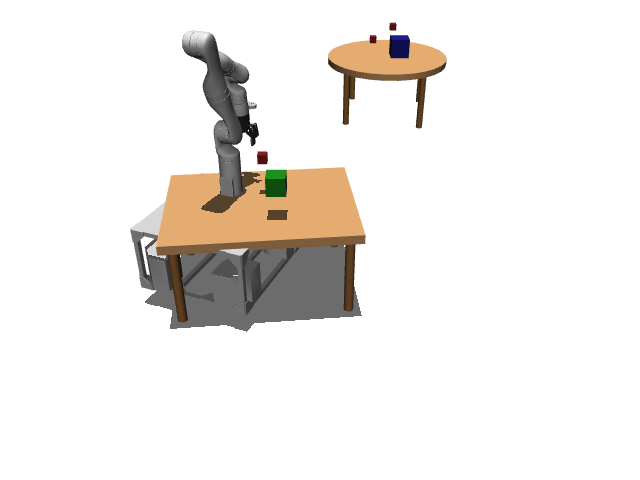
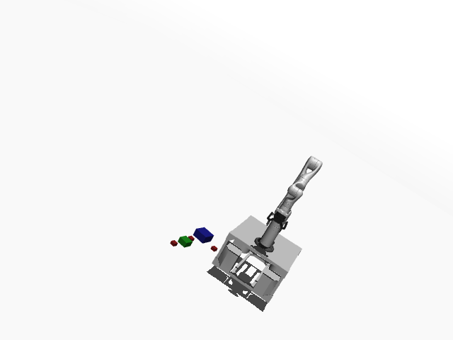

# TidyBot3D-dynamic-lab2-o2-toss_the_blocks_into_the_bin

## Usage
```python
import prbench
env = prbench.make("prbench/TidyBot3D-dynamic-lab2-o2-toss_the_blocks_into_the_bin-v0")
```

## Description
This variant uses the 'lab2' scene type with 2 objects.

## Initial State Distribution


## Random Action Behavior


## Example Demonstration
*(No demonstration GIFs available)*

## Observation Space
The entries of an array in this Box space correspond to the following object features:
| **Index** | **Object** | **Feature** |
| --- | --- | --- |
| 0 | bin_0 | x |
| 1 | bin_0 | y |
| 2 | bin_0 | z |
| 3 | bin_0 | qw |
| 4 | bin_0 | qx |
| 5 | bin_0 | qy |
| 6 | bin_0 | qz |
| 7 | bin_0 | vx |
| 8 | bin_0 | vy |
| 9 | bin_0 | vz |
| 10 | bin_0 | wx |
| 11 | bin_0 | wy |
| 12 | bin_0 | wz |
| 13 | bin_0 | bb_x |
| 14 | bin_0 | bb_y |
| 15 | bin_0 | bb_z |
| 16 | cube_0 | x |
| 17 | cube_0 | y |
| 18 | cube_0 | z |
| 19 | cube_0 | qw |
| 20 | cube_0 | qx |
| 21 | cube_0 | qy |
| 22 | cube_0 | qz |
| 23 | cube_0 | vx |
| 24 | cube_0 | vy |
| 25 | cube_0 | vz |
| 26 | cube_0 | wx |
| 27 | cube_0 | wy |
| 28 | cube_0 | wz |
| 29 | cube_0 | bb_x |
| 30 | cube_0 | bb_y |
| 31 | cube_0 | bb_z |
| 32 | cube_1 | x |
| 33 | cube_1 | y |
| 34 | cube_1 | z |
| 35 | cube_1 | qw |
| 36 | cube_1 | qx |
| 37 | cube_1 | qy |
| 38 | cube_1 | qz |
| 39 | cube_1 | vx |
| 40 | cube_1 | vy |
| 41 | cube_1 | vz |
| 42 | cube_1 | wx |
| 43 | cube_1 | wy |
| 44 | cube_1 | wz |
| 45 | cube_1 | bb_x |
| 46 | cube_1 | bb_y |
| 47 | cube_1 | bb_z |
| 48 | robot | pos_base_x |
| 49 | robot | pos_base_y |
| 50 | robot | pos_base_rot |
| 51 | robot | pos_arm_joint1 |
| 52 | robot | pos_arm_joint2 |
| 53 | robot | pos_arm_joint3 |
| 54 | robot | pos_arm_joint4 |
| 55 | robot | pos_arm_joint5 |
| 56 | robot | pos_arm_joint6 |
| 57 | robot | pos_arm_joint7 |
| 58 | robot | pos_gripper |
| 59 | robot | vel_base_x |
| 60 | robot | vel_base_y |
| 61 | robot | vel_base_rot |
| 62 | robot | vel_arm_joint1 |
| 63 | robot | vel_arm_joint2 |
| 64 | robot | vel_arm_joint3 |
| 65 | robot | vel_arm_joint4 |
| 66 | robot | vel_arm_joint5 |
| 67 | robot | vel_arm_joint6 |
| 68 | robot | vel_arm_joint7 |
| 69 | robot | vel_gripper |
